# 🛸 Command Center — AI Workspace

> **Your intelligent command center for AI-powered development workflows.**  
> Built with React + FastAPI + Gemini AI — deployed live and fully functional.


---

## 🌐 Live Demo

| Service | URL |
|---|---|
| **Frontend** | https://command-center-git-main-arzoo1701s-projects.vercel.app |
| **Backend API** | https://zoo-command-center-api.onrender.com |

---

## 📸 Screenshots

### 🔐 Login
> Secure authentication portal with Google OAuth and email/password support.

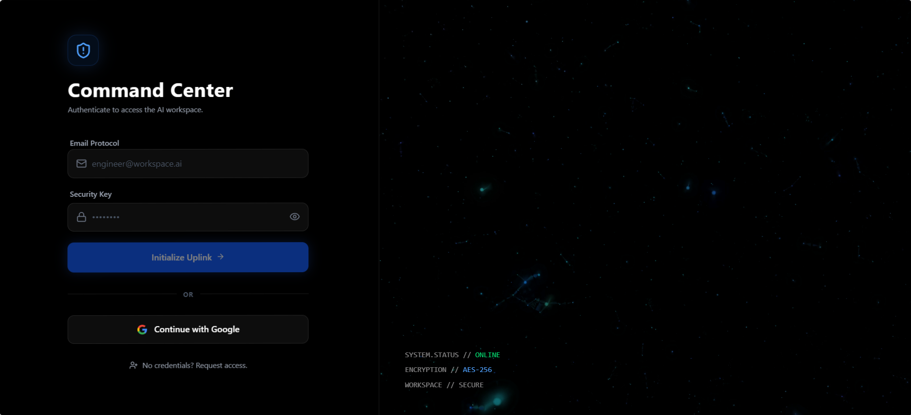

---

### 🏠 Dashboard
> Mission-control home screen with live module status, uptime, API latency, and quick access to all 6 tools.

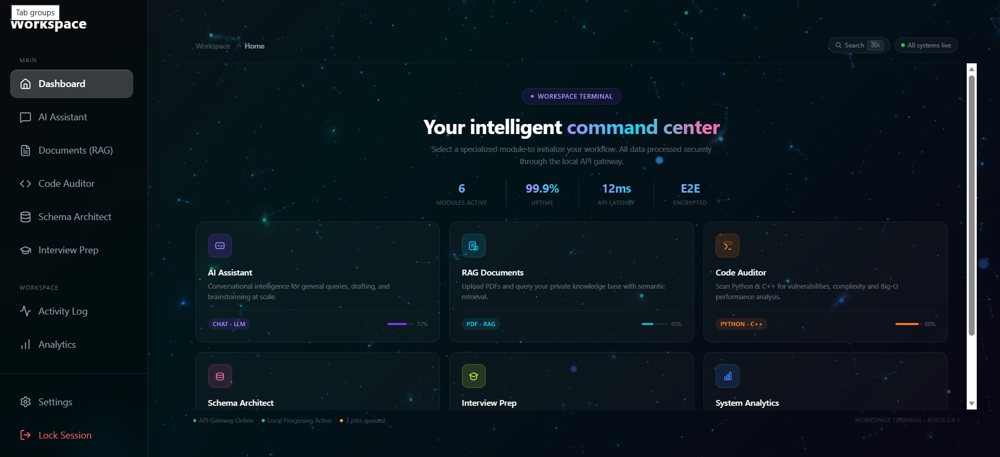

---

### 🤖 AI Assistant
> Ask anything — with or without uploaded documents. Gemini answers instantly.

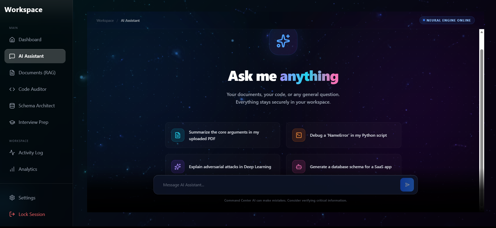
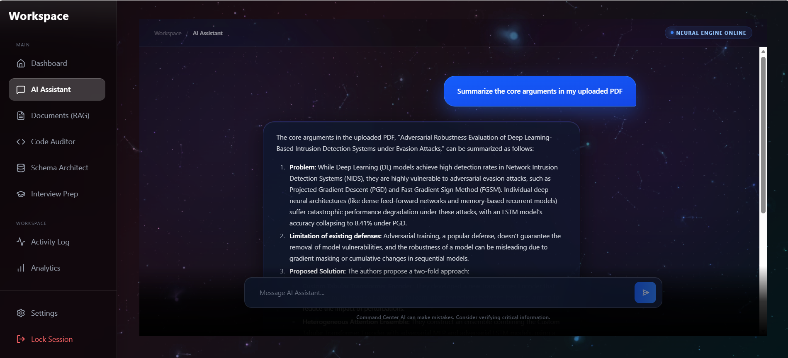

---

### 📄 Documents (RAG)
> Upload PDFs or text files. The AI reads and answers from your document's full context.

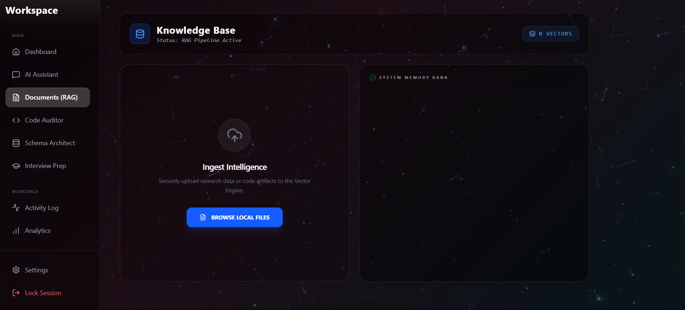
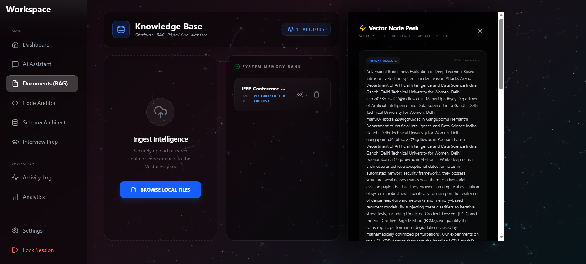

---

### 🔍 Code Auditor
> Paste Python or C++ code. Get a vulnerability report, Big-O complexity score, and AI-refactored version.

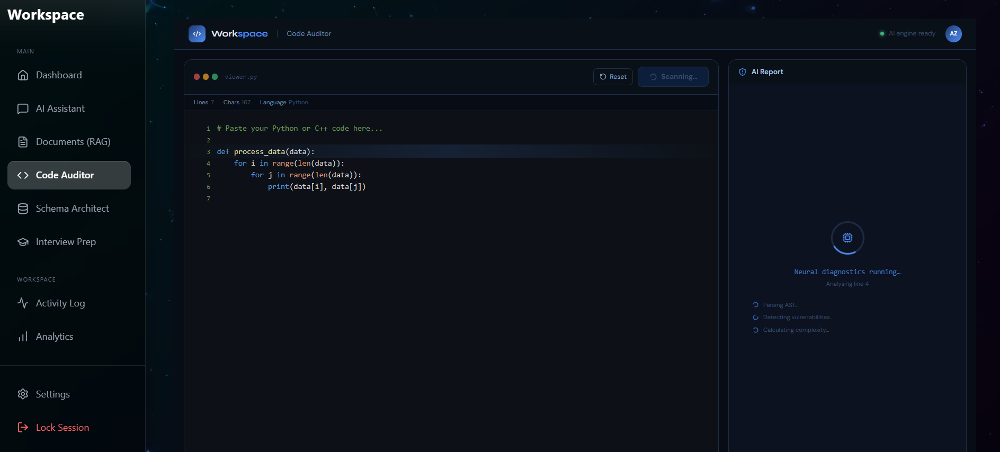
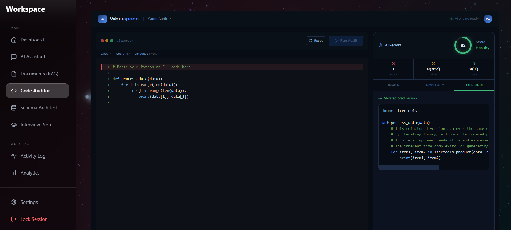

---

### 🗄️ Schema Architect
> Describe any app — get a full database schema with visual cards, SQL statements, entity relations, and AI architectural insights.

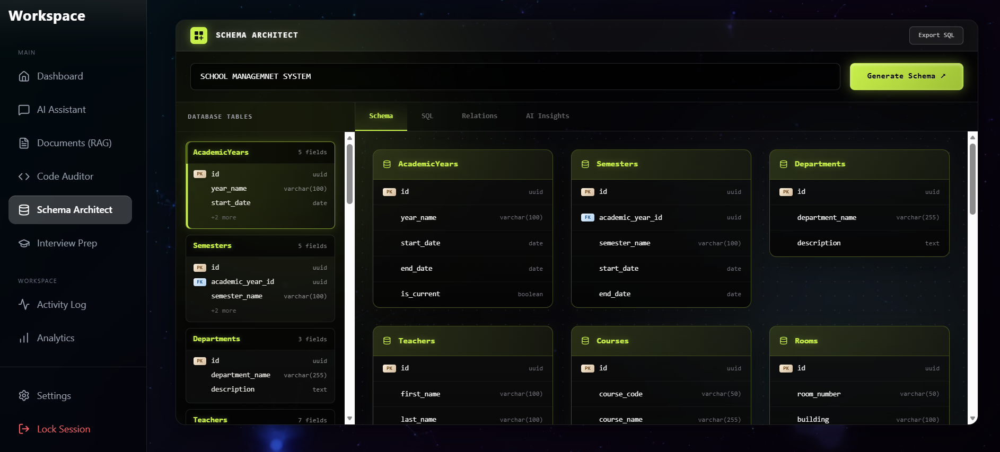
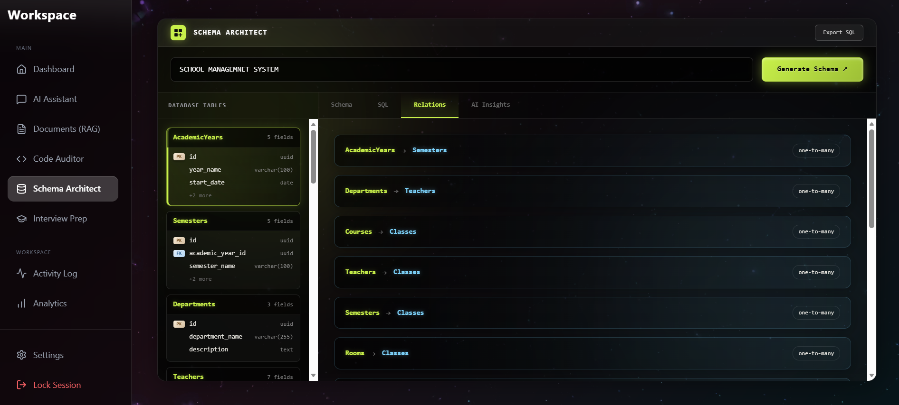
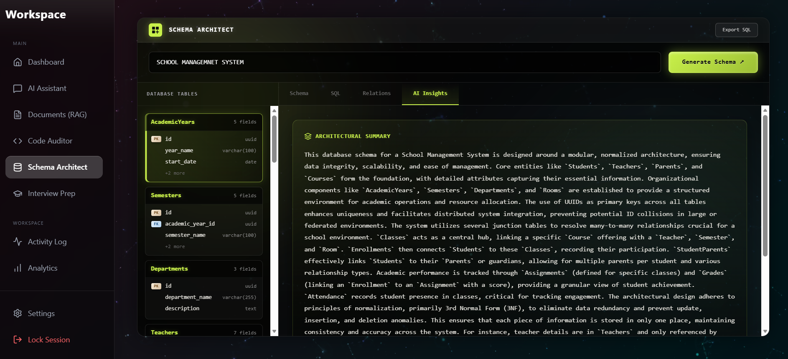

---

### 🎓 Interview Prep
> Three-in-one: LeetCode problems with live code execution, AI flashcard generator, and SQL practice sandbox.

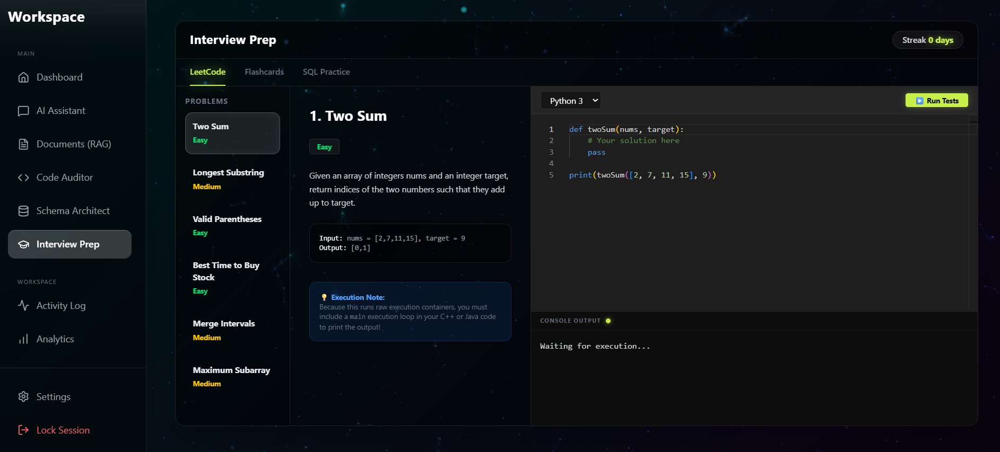
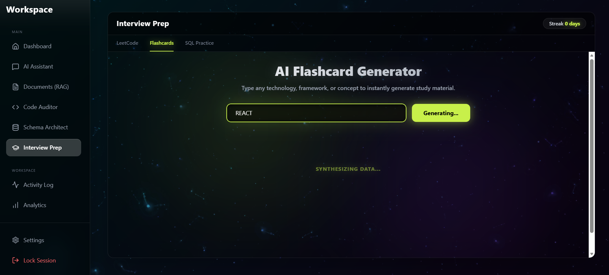
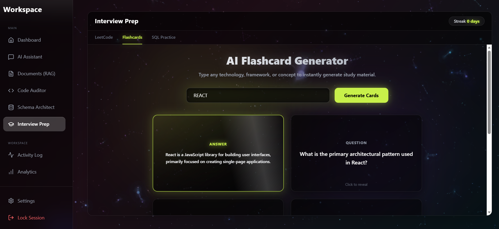
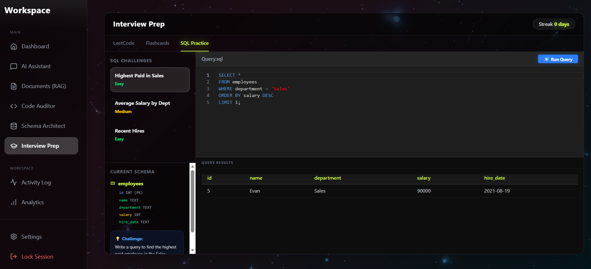

---

### 📊 Analytics & Activity Log
> Live usage dashboard with charts, tool breakdowns, and a full immutable system audit trail.

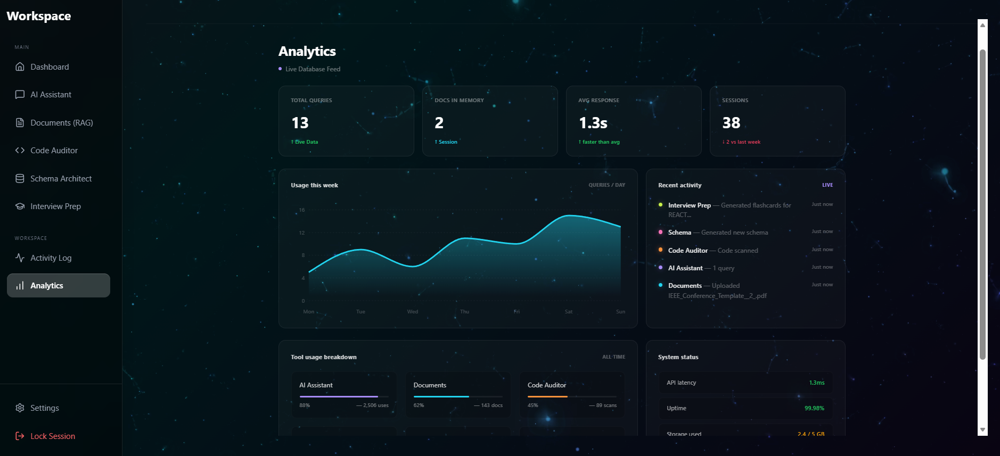
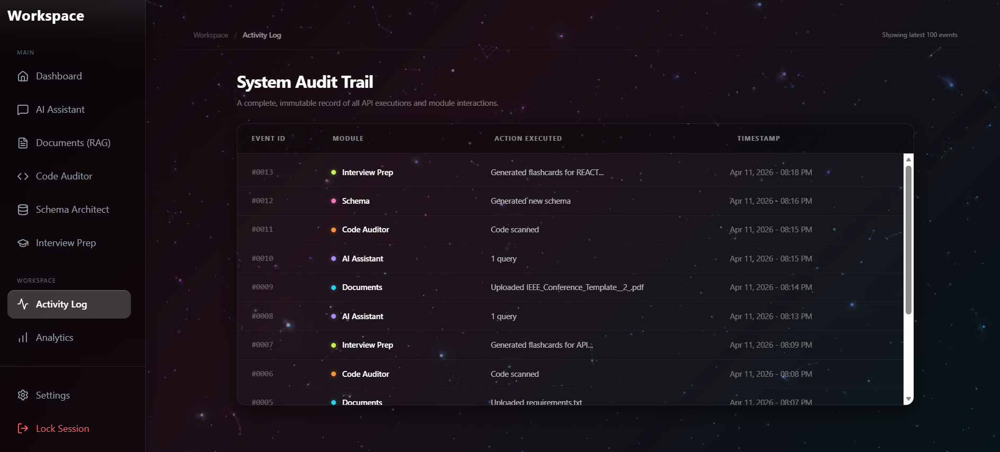

---

## ✨ Features

- **AI Chat (RAG)** — Upload research PDFs and ask questions. Gemini reads the full document context directly.
- **Code Auditor** — Paste Python or C++ code. Get vulnerability report, Big-O complexity analysis, and an AI-refactored version with a health score.
- **Schema Architect** — Type a description like "school management system" and get: visual schema cards, SQL `CREATE` statements, entity relations, and architectural AI insights. Export SQL with one click.
- **Interview Prep — LeetCode** — Solve Two Sum, Longest Substring, Valid Parentheses and more. Run Python, Java, or C++ code with hidden test cases.
- **Interview Prep — Flashcards** — Type any topic (e.g. "REACT", "System Design") and get 6 AI-generated Q&A flashcards instantly.
- **Interview Prep — SQL Practice** — Real SQLite sandbox with preloaded `employees` table. Write and run live SQL queries.
- **System Audit Trail** — Every action across every module is logged with timestamps. Full immutable activity history.
- **Analytics Dashboard** — Live query counts, docs in memory, tool usage breakdown, weekly usage chart, and system status.
- **Google Auth** — Secure login via Firebase Authentication.

---

## 🏗️ Tech Stack

### Frontend
| Tech | Usage |
|---|---|
| React 19 + Vite | Core framework |
| Tailwind CSS v4 | Styling |
| Framer Motion | Animations |
| React Router v7 | Navigation |
| Monaco Editor | Code editor in Code Auditor |
| Recharts | Analytics charts |
| React Markdown | AI response rendering |
| Firebase | Google Authentication |

### Backend
| Tech | Usage |
|---|---|
| FastAPI | REST API framework |
| Google Gemini 2.5 Flash | AI responses, code audit, schema gen, flashcards |
| LangChain + PyPDF | Document loading and text splitting |
| SQLAlchemy + SQLite | User progress, activity logs, SQL sandbox |
| Uvicorn | ASGI server |

---

## 🚀 Getting Started (Local)

### Prerequisites
- Node.js 18+
- Python 3.11+
- A Google Gemini API key → [Get one free](https://aistudio.google.com/apikey)
- A Firebase project → [console.firebase.google.com](https://console.firebase.google.com)

---

### 1. Clone the repo
```bash
git clone https://github.com/Arzoo1701/command-center.git
cd command-center
```

### 2. Frontend Setup
```bash
npm install
```

Create a `.env` file in the root:
```env
VITE_FIREBASE_API_KEY=your_firebase_api_key
VITE_FIREBASE_AUTH_DOMAIN=your_project.firebaseapp.com
VITE_FIREBASE_PROJECT_ID=your_project_id
VITE_FIREBASE_STORAGE_BUCKET=your_project.appspot.com
VITE_FIREBASE_MESSAGING_SENDER_ID=your_sender_id
VITE_FIREBASE_APP_ID=your_app_id
VITE_API_URL=http://localhost:8000
```

```bash
npm run dev
```

### 3. Backend Setup
```bash
pip install -r requirements.txt
```

Create a `.env` in the backend folder:
```env
GOOGLE_API_KEY=your_gemini_api_key
```

```bash
uvicorn main:app --reload --port 8000
```

### 4. Open the app
```
Frontend: http://localhost:5173
Backend:  http://localhost:8000/docs
```

---

## 📁 Project Structure

```
command-center/
├── screenshots/               ← Add your screenshots here
├── src/
│   ├── components/
│   │   ├── Chat.jsx           # AI Assistant
│   │   ├── Documents.jsx      # RAG Document Upload
│   │   ├── CodeAuditor.jsx    # Code Security Scanner
│   │   ├── Schema.jsx         # DB Schema Generator
│   │   ├── InterviewPrep.jsx  # LeetCode + Flashcards + SQL
│   │   ├── Analytics.jsx      # Live Dashboard
│   │   └── ActivityLog.jsx    # Audit Trail
│   ├── lib/
│   │   └── firebase.js
│   └── main.jsx
├── main.py                    # FastAPI backend
├── requirements.txt
├── index.html
└── vite.config.js
```

---

## 🔌 API Endpoints

| Method | Endpoint | Description |
|---|---|---|
| `GET` | `/` | Health check |
| `POST` | `/api/chat` | Chat with AI |
| `POST` | `/api/upload` | Upload document to memory |
| `POST` | `/api/audit` | Scan code for vulnerabilities |
| `POST` | `/api/schema` | Generate database schema |
| `POST` | `/api/flashcards` | Generate flashcards |
| `POST` | `/api/execute` | Run Python/Java/C++ code |
| `POST` | `/api/sql` | Execute SQL in sandbox |
| `GET` | `/api/analytics` | Usage analytics |
| `GET` | `/api/activity` | Full activity log |

---

## ☁️ Deployment

### Frontend → Vercel
1. Push to GitHub → Connect to [vercel.com](https://vercel.com)
2. Add all `VITE_*` env variables in Vercel settings
3. Deploy ✅

### Backend → Render
1. Connect repo to [render.com](https://render.com)
2. **Build Command:** `pip install -r requirements.txt`
3. **Start Command:** `uvicorn main:app --host 0.0.0.0 --port $PORT`
4. Add env variable: `GOOGLE_API_KEY`
5. Deploy ✅

> ⚠️ Render free tier sleeps after 15 mins idle. First request may take ~30s to wake up.

---

## 👩‍💻 Built By

**Arzoo** — Department of Artificial Intelligence and Data Science  
Indira Gandhi Delhi Technical University for Women (IGDTUW), Delhi

---

## 📄 License

This project is built for educational and hackathon purposes.